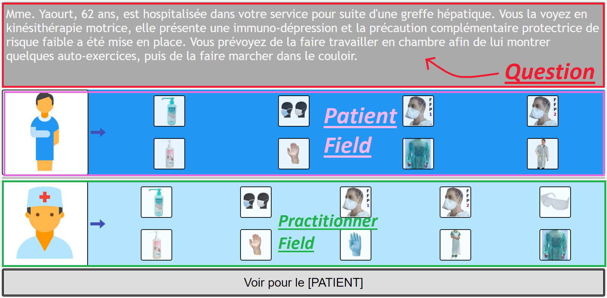
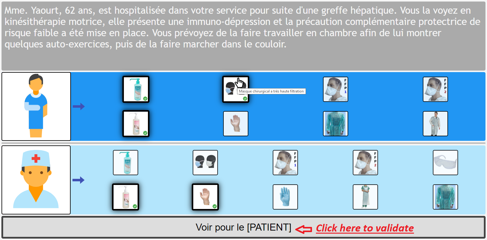
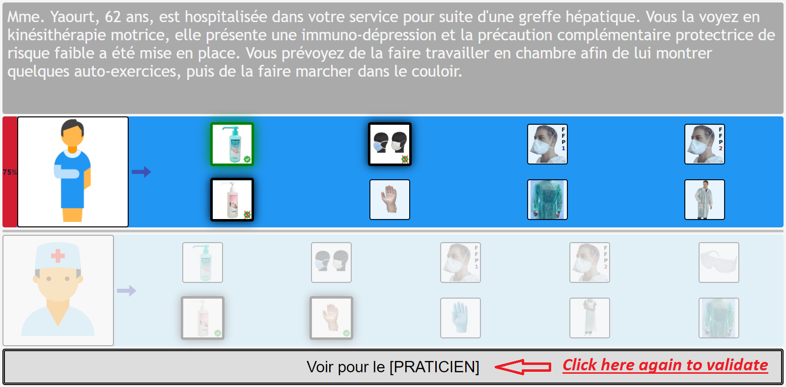
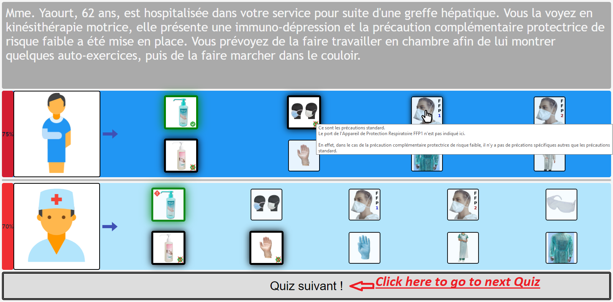
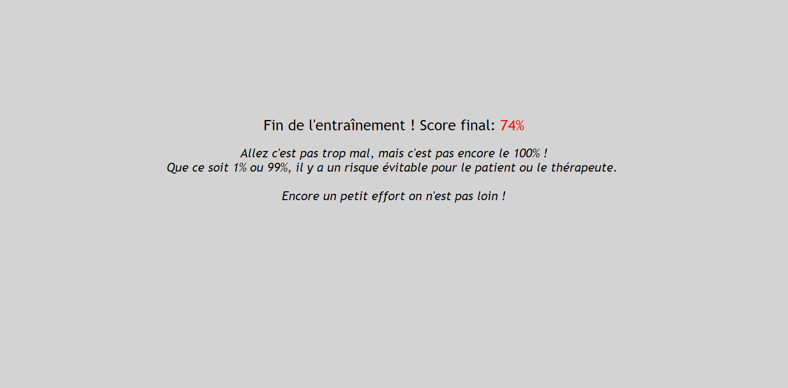
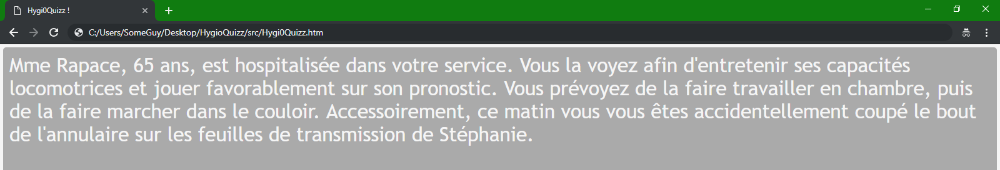
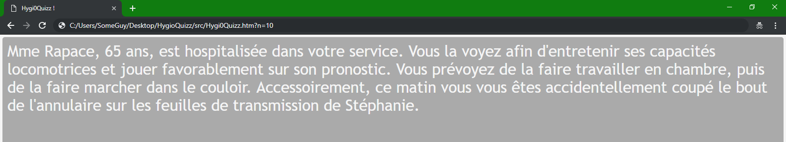
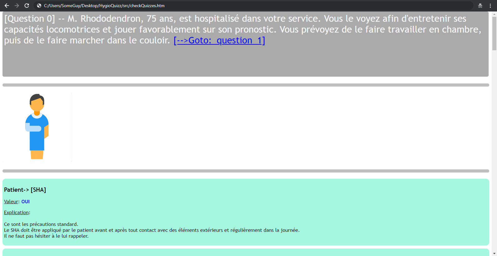
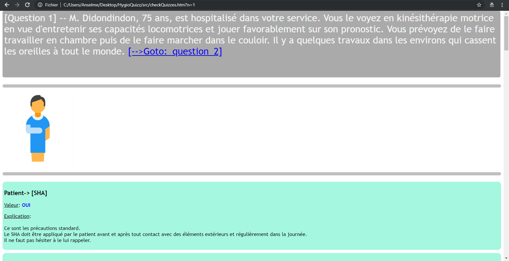
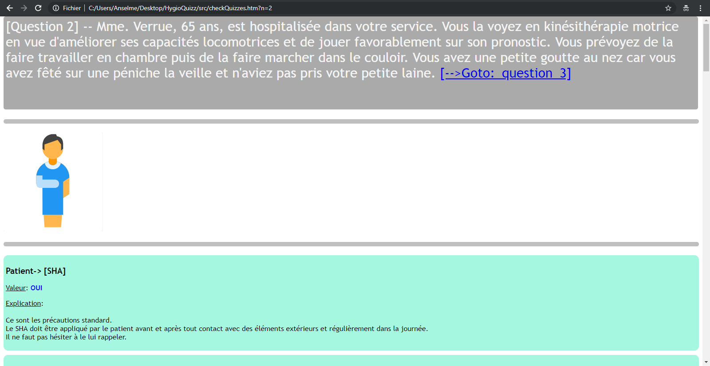

# Hygi0Quizz
*Une application de jeu de Quiz développée en [HTML/Javascript-jQuery], visant à apprendre les recommandations d'hygiène et s'entraîner en tant que professionnel de santé*

**Si vous voulez l'essayer directement, cliquez ici !** --> https://somebodylikeeverybody.github.io/try_Hygi0Quizz/

## I) Explications
Le but de cette application est d'apprendre facilement les recommandations d'hygiène d'une structure de santé.  
J'ai pu remarquer que l'application des mesure d'hygiène par les opérateurs au sein de structures de santé est quelque chose de compliqué, en particulier du fait de 3 facteurs:  
1) L'apprentissage des recommandations d'hygiène par les opérateurs, tâche qui peut être difficile et laborieuse
2) La discordance entre les recommandations  théoriques et la réalité du terrain, quand l'échelle de valeur des recommandations ne rejoint pas forcément celles des opérateurs
3) Les difficultés logistiques à appliquer les recommandations, du fait d'un manque de temps ou de moyens

Cette application a pour but de résoudre le premier point en **diminuant l'énergie nécessaire à apprendre les recommandations**, en utilisant des cas concrets et une approche d'apprentissage de type "essai-erreur", le tout dans une application web qui se veut ludique.
Cette application a également pour but de d'affecter positivement le second point cité en **encourageant le dialogue entre les opérateurs et l'équipe d'hygiène**, favoriser les échanges sur les cas spécifiques décris, les impossibilités logistiques d'appliquer les réponses proposées, les divergence d'échelles de valeurs, etc.

## II) Informations techniques 
Hygi0Quizz est une application web exclusivement front-end, utilisant HTML et jQuery. Ce choix a été fait afin d'obtenir un outil très simple à déployer. Point besoin de connexion internet ou de serveur sur lequel placer l'application, la seule chose nécessaire est un navigateur web (chrome, firefox, internet explorer, ...). Vous placez le répertoire sur l'ordinateur, lancez le fichier "Hygi0Quizz.htm" dans un navigateur web et vous jouez, c'est tout !  
  
Il y a 2 parties dans l'application: 
- Une **partie quiz**, incarnée par le fichier **"quizzes.js"**, qui contient tous les quizs et les explications de chaque réponse, sous la forme d'un objet JS, fichier qui peut être modifié manuellement ou avec un outil simplificateur, afin de mettre à jour les quizs et les réponses en fonction de l'évolution des recommandations *(un outil visant à générer le fichier quizzes.js depuis une simple interface graphique devrait arriver bientôt)*
- Une **partie technique**, constituée par les fichiers nécessaire au fonctionnement propre de l'application (Hygi0Quizz.htm, checkQuizzes.htm, ./resources/\*), qui n'ont pas besoin d'être modifiés de prime abord.

Pour information, le fichier **Hygi0Quizz.htm** est le fichier permettant de lancer l'application de quizs d'entraînement, tandis que le fichier **checkQuizzes.htm** est un fichier permettant de voir tous les quizs et les réponses à ces derniers. Son utilisation est détaillée dans la partie **Comment l'utiliser** . 

## III) Installation
- Étape 1: Téléchargez le fichier en cliquant sur le bouton "Clone or download", et dé-compressez le dans le dossier que vous voulez (disons yourFolder par exemple)
- Étape 2: Créez sur votre bureau un raccourci vers yourFolder/HygioQuizz/src/Hygi0Quizz.htm afin de simplifier le lancement de l'application
- Étape 3: Modifiez le fichier quizzes.js (*situé dans yourFolder/HygioQuizz/src/quizzes.js*) avec votre éditeur de texte favori, afin de définir vos propres questions et réponses
- Étape 4: Cliquez sur le raccourci que vous venez de créer afin de lancer l'application et jouez ou faites jouer autant que vous voulez

## IV) Comment l'utiliser
### IV.1) Fonctionnalité Hygi0Quizz :
C'est le **Jeu de Quizz**. Quand vous le lancez, il se présente comme suit:
  
  
  
  
  

#### IV.1.1) Voici ce qu'il faut savoir:  
1)  Il y a une situation concrète / question décrite en haut de la page.  
  
2)  Il y a 2 champs: un **champs Patient**, et un **champs Praticien**.  
  
3)  Vous devez **cliquer sur les équipements que vous recommandez** pour le patient dans **le champs Patient**, et sur les équipements que vous recommandez pour le praticien dans le **champs Praticien**. Vous pouvez survoler avec la souris un item pour voir le détail de l'équipement dans une  **info-bulle**.    
  
4) Quand vous **validez** votre réponse en cliquant sur le bouton **_"Voir pour le [PATIENT]"_**, cela va montrer les réponses attendues pour le champs patient. Vous pouvez obtenir des explications détaillées sur chaque réponse dans une **info-bulle** en survolant l'item avec la souris.
- Si l'icône équipement que vous avez sélectionnée est correcte, elle sera entourée par un halo vert
- Si l'icône équipement que vous avez sélectionnée n'est pas correcte, le signe "check" dans la partie inférieure droite de l'icône sera barrée
- Si vous n'avez pas sélectionné un équipement que vous auriez dû, il sera entouré d'un halo vert et un signe "Attention" rouge sera notifié dans la partie supérieure gauche de l'icône.
  
5) Ensuite vous devez cliquer sur le bouton **_"Voir pour le [PRATICIEN]"_**, ce qui va montrer les réponses attendues pour le champs praticien. Vous pouvez avoir des explications détaillées dans une **info-bulle** pour chaque réponse en survolant l'item avec la souris.  
  
6) Ensuite vous cliquez sur le bouton *"Quiz suivant !"* afin de charger la question suivante  
  
7) Vous recommencez avec la nouvelle question. Vous devez répondre à 5 questions au total afin d'obtenir un score final. Simple !  
  
  
  
#### IV.1.2) Informations supplémentaires:
Par défaut, **vous devez répondre à 5 questions pour avoir un score final**, 5 questions tirées au hasard parmi toutes les questions stockées dans le fichier quizzes.js.  
  
**Si le fichier quizzes.js contient moins de 5 questions**, vous devrez répondre à toutes les questions contenues dans le fichier pour avoir un score final, c'est auto-géré !  
  
Par ailleurs, c'est **5 questions par défaut, mais vous pouvez modifier ce nombre** en ajoutant `?n=X` à la fin de l'url puis en appuyant sur la touche "Entrée" pour faire des sessions d'entrainement de 1, 2, 3, ..., ou toutes les questions du fichier quizzes.js. Si vous avez entré un nombre supérieur au nombre de questions disponibles, cela va définir le nombre au nombre de question contenues dans le fichier quizzes.js, c'est auto-géré !  
  
  
  
### IV.2) Fonctionnalité CheckQuizzes:
C'est un fichier permettant de **voir toutes les questions et les réponses stockées dans quizzes.js**, très utile si vous voulez voir les questions et les réponses du fichier quizzes.js avec une mise en forme beaucoup plus lisible qu'en lisant directement le contenu du fichier.  
  
Pour l'utiliser il suffit de cliquer sur **yourFolder/HygioQuizz/src/CheckQuizzes.htm**, ce qui lancera l'application dans votre navigateur web, et affichera la première question du fichier quizzes.js (question 0).  
  
  
  
  
**Pour voir la question suivante et ses réponses**, cliquez sur le lien "Goto question X".  
  
  
  
    

#### Importante dernière chose
Techniquement, l'index de la question affichée dans CheckQuizzes est la valeur de `$_GET['n']`, **donc pour voir directement la question numéro K**, ajoutez simplement `?n=K` à la fin de l'url dans le navigateur, et appuyez sur "Entrée".  
  
Voilà c'est tout, bonne utilisation ! 
