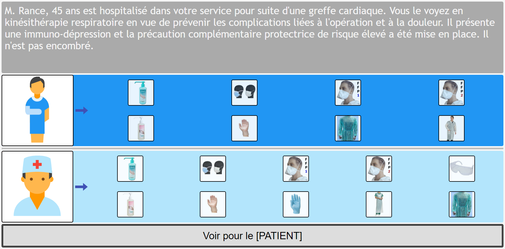
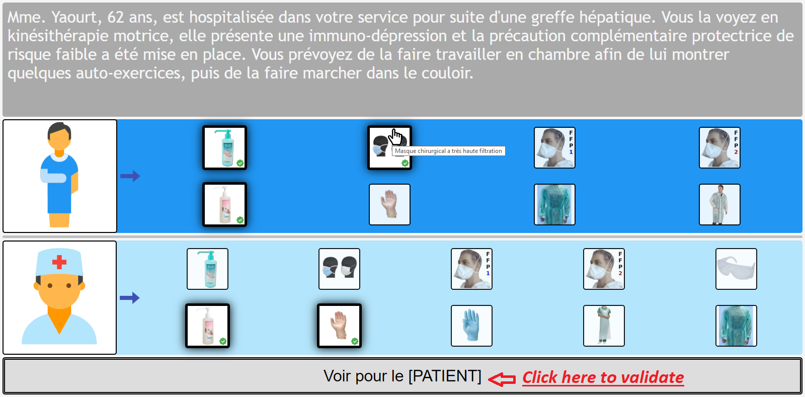
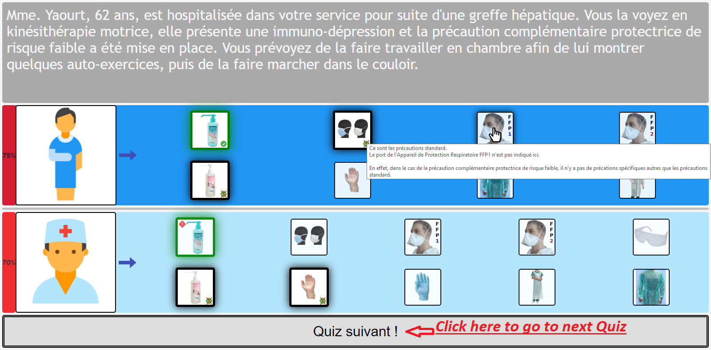

# Hygi0Quizz
*A Quiz Game in [HTML/Javascript-jQuery] to teach and train people to hygiene recommendations*

**If you want to try it directly, just go there !** --> https://somebodylikeeverybody.github.io/try_Hygi0Quizz/

## I) Explanation
The purpose of this application is to easily learn hygiene recommendations of the structure you work at.  
I noticed that application of hygiene measures at work by operators is something hard because of 3 things
1) The learning of the hygiene recommendations of the structure by the operators, that could be hard and unpleasing
2) The discordance between theorical cases and reality, when the scale of values of the recommendations doesn't meet the operators' ones
3) The logistical difficulty of applying the recommandations, due to lack of time or resources

This application has the purpose to solve the first point by **decreasing the constraint to overcome to learn the recommendations**, this by using concretes situation and trial and error learning strategy, on a funny web application.
This also have the purpose to affect positively the second point by **encouraging dialog between operators and hygiene team** about specific hygiene cases, problems encountered in the unit, scales of values, etc.

## II) Technical informations
This is a web application exclusively in front-end, using html and jQuery. This choice has been made to have something really simple to deploy. You don't need any internet connection or any server, the only thing you need is a web browser. You put the directory on the computer, launch it into the web browser and play, that's it.  
  
There's 2 parts in the application: 
- A **quizz part**, embodied by the file **"quizzes.js"**, that contain all the quizzes and the explanations of each answers in the form of a JS Object, file that can be modified manually or with a simplifying tool to update quizzes and answers with recommendations evolutions *(a tool to easily generate the quizzes.js file from a Graphical User Interface is comming soon)*
- A **technical part**, composed by files to run the application (Hygi0Quizz.htm, checkQuizzes.htm, ./resources/\*), that doesn't need to be modified.

For information, the **Hygi0Quizz.htm** file is the file to launch the training appliction, while **checkQuizzes.htm** is a file to see all the quizzes and the answers. Its use is detailed in the **How to use** section. 

## III) Installation
- Step 1: Download the folder by clicking on "Clone or download" button, and unzip it into the folder you want to put in 
- Step 2: Create a shortcut to yourFolder/HygioQuizz/src/Hygi0Quizz.htm on your desktop, to make the launch simpler
- Step 3: Modify the quizzes.js file (*at yourFolder/HygioQuizz/src/quizzes.js*) with your favorite text editor to specify your own questions and answers
- Step 4: Click on the shortcut to Hygi0Quizz.htm to launch the application and play as much as you want

## IV) How to use
### IV.1) Use Hygi0Quizz feature:
This is the **Game File**. When you launch it, it presents as following:  
  
  
  
  
  

#### IV.1.1) Here are the informations to know:  
1)  There is a concrete situation / question described at the top of the page.  
  
2)  There are 2 fields: a **Patient field**, and a **Practitionner field**.  
  
3)  You have to **click on the equipments you recommand** for the patient in **the Patient Field**, and on the equipments you recommand for the practitionner in the **Practitionner Field**. You can hover an item to see the detail of the equipment in an **tooltip**.    
  
4) Then you **validate** your answer by clicking on **_"Voir pour le [PATIENT]"_** button, that will show the expected answers for the Patient field. You can have a detailed explanation of each answer in a **tooltip** by hovering the item.
- If the equipment icon you checked is correct, it will be surrounded with a green halo
- If the equipment icon you checked isn't correct, the "check" sign at the bottom-right of the icon will be crossed
- If you didn't check an equipment you should have check, it will be surrounded with a green halo and a red "Attention" sign will be notified at the top-left or the icon.
  
5) Then you have to click on **_"Voir pour le [PRATICIEN]"_** button, that will show the expected answers for the Practitionner field. You can have a detailed explanation of each answer in a **tooltip** by hovering the item  
  
6) Then you click on *"Quiz suivant !"* button to load the next question  
  
7) You start again with a new question. You have to answer to 5 questions in total to get a final score. Simple !  
  
  
  
#### IV.1.2) Further informations:
By default, **you have to answer to 5 questions to get a final score**, 5 questions that are taken randomly in all the questions written in the quizzes.js file.  
  
**If your quizzes.js file have less than 5 questions** you will have to answer to all questions that are in the file to get a score, it is self managed !  
  
However, it is **5 questions by default, but you can modify this** by adding `?n=X` at the end of the url and pressing entry to train with 1, 2, 3, ..., all questions in the quiz. If you enter a number greater than the number of questions available, it will set a number equal to the number of the questions, it is self managed !  
  
  
  
### IV.2) Use CheckQuizzes feature:
This is a file to **see all the questions and answers stored in quizzes.js**, useful if you want to check the questions in a prettier view than directly in the quizzes.js file.  
  
You launch it by clicking on **yourFolder/HygioQuizz/src/CheckQuizzes.htm**, that will launch it into your web browser and show the first question of the quizzes.js file (question 0).  
  
  
  
  
**To see the next question and answers**, you click on the link "Goto question X".  
  
  
  
    

#### Important final thing
Technically, the index of the question shown in the page is the value of `$_GET['n']`, **so to see directly question number K**, just add `?n=K` at the end of the url in the browser and press enter.
